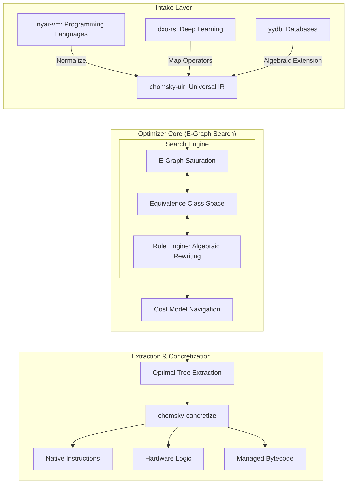

# 🧠 Project Chomsky: Universal Grammar for Universal Optimization

[](https://opensource.org/licenses/MPL-2.0)
[](#)
[](#)

Project Chomsky is a revolutionary compilation optimization framework designed to achieve **Universal Optimization** across languages and hardware platforms. By leveraging the concept of "Universal Grammar" and advanced **E-Graph** technology, it reduces diverse computational patterns into a unified set of semantic intents for deep, automated optimization.

---

## 🏛️ System Architecture

Chomsky adopts a decoupled "Optimization Search" architecture, moving away from traditional phase-ordered passes to a saturation-based equivalence search.

### 🔄 The Optimization Pipeline



---

## 🎯 Core Design Philosophy

### 🧬 Universal Grammar of Computation
Just as Noam Chomsky posited that human languages share a deep structure, Project Chomsky believes all computational patterns can be reduced to core **Intents**. We map various domains (PL, DL, SQL) to these intents to enable cross-domain optimization.

### 📊 E-Graph Saturation
Instead of fragile, order-dependent optimization passes, Chomsky uses E-Graphs to represent a massive space of equivalent programs. It applies rewrite rules until saturation, ensuring that the optimal version of a program is found regardless of the input's original form.

### ⚖️ Multi-Dimensional Cost Modeling
Optimization is guided by a sophisticated cost engine. It doesn't just look at instruction count, but navigates the optimal path using vectors for **Latency**, **Power Consumption**, **Memory Footprint**, and **Hardware Area**.

---

## 🚀 Key Features & Capabilities

### 🛠️ Cross-Domain Optimization
- **Programming Languages**: Normalizes control flow, closures, and object models into intent atoms.
- **Deep Learning**: Automates Operator Fusion and memory layout reorganization for heterogeneous hardware.
- **Relational Algebra**: Solves complex Join Reordering and Predicate Pushdown through algebraic rewriting.

### ⚡ Advanced Engineering
- **Phase-Ordering Independence**: Solves the traditional compiler problem where the order of optimizations affects the final result.
- **Incremental Search**: Efficiently explores large optimization spaces without exponential blowup.
- **Hardware-Aware Rewriting**: Pluggable rule sets for specific target architectures (x86, ARM, GPU, FPGA).

---

## 📂 Project Ecosystem

| Component | Description | Technical Path |
| :--- | :--- | :--- |
| **`chomsky-uir`** | Intent Dependency Graph (IDG) based on E-Graph representation. | [`/packages/chomsky-uir`](./packages/chomsky-uir) |
| **`chomsky-rules`** | Universal optimization rewrite rule set for algebraic transformations. | [`/packages/chomsky-rules`](./packages/chomsky-rules) |
| **`chomsky-cost`** | Multi-dimensional cost models for optimal path navigation. | [`/packages/chomsky-cost`](./packages/chomsky-cost) |
| **`chomsky-concretize`** | Logic for converting optimized intents back into target-specific IR. | [`/packages/chomsky-concretize`](./packages/chomsky-concretize) |
| **`chomsky-rule-engine`**| High-performance E-Graph saturation and matching engine. | [`/packages/chomsky-rule-engine`](./packages/chomsky-rule-engine) |

---

## 💻 Getting Started

### 🛠️ Build & Development
Project Chomsky is managed as a Rust Workspace.

```bash
# Build the entire framework
cargo build --workspace --release

# Run the optimization test suite
cargo test --workspace
```

### 📖 Documentation
Detailed guides on adding new frontends or hardware backends are available in the documentation.

```bash
cd documentation
npm install
npm run dev
```

---

## 📜 License

Project Chomsky is open-source software licensed under the **Mozilla Public License 2.0 (MPL-2.0)**. See [License.md](./License.md) for details.

---
**Let computation return to its essence.**
